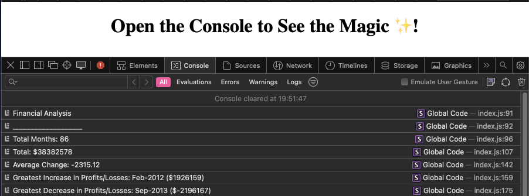

# Finances in Console

## Description 

Given a 2D-array containing 3 years worth of financial data I have made several calculations on the array's data and displayed these calculation in the console using javaScript.

## Usage 
[Deployed Application](https://korrin-f.github.io/console-finances/)

Visit the deployed application using the link above and open the console window. There you should see the logs containing the data I have gathered from the 2D-array. 

## License

See licence in repo.

## Badges

